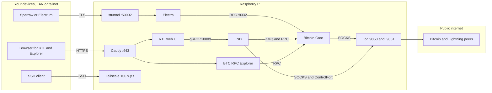
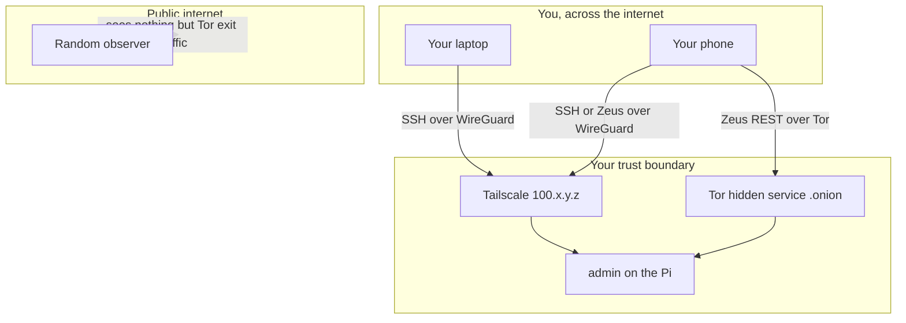

You're about to install roughly a dozen services on a single box. It
helps to see the map before you start laying the track. This page is
that map: what talks to what, which ports matter, where your node
faces the public internet and where it faces you.

No commands here. The install steps live in the sections that
follow. This is strictly orientation.

## Services and traffic

**Reading the arrows.** A one-way arrow is the direction a request
flows: the caller talks, the callee answers. The protocol label is
the channel. **RPC** is JSON-over-HTTP to Bitcoin Core. **gRPC** is
LND's binary protocol. **ZMQ** is Bitcoin Core pushing new-block and
new-transaction events to LND without polling. **SOCKS** is Tor's
way of letting an application route its outbound traffic through the
onion network. **TLS** is Electrum over stunnel, HTTPS is everything
going through Caddy, and SSH is how you reach the Pi (directly on
the LAN, or through Tailscale from anywhere else).

**Main takeaway:** Bitcoin Core is the only service that actually
validates the chain. Everything else is a consumer of that one
answer.

## What each component does

| Service | One-liner |
| --- | --- |
| [Bitcoin Core](/docs/bitcoin/bitcoin-client) | The full node. Verifies every block, maintains the UTXO set, speaks the peer-to-peer protocol. |
| [Electrs](/docs/bitcoin/electrum-server) | Indexes Bitcoin Core's data so wallets can ask "what's the balance of this address?" in milliseconds. |
| [LND](/docs/lightning/lightning-client) | Your Lightning node. Opens channels, routes payments, holds the hot wallet. |
| [BTC RPC Explorer](/docs/bitcoin/blockchain-explorer) | A private web explorer for your own blockchain. Mempool, fees, block details, all without leaking queries to a third party. |
| [RTL](/docs/lightning/web-app) | Web dashboard for LND. Channels, payments, routing stats. |
| Tor | Routes the P2P traffic of Bitcoin Core and LND through the onion network, keeping your home IP off the public peer maps. |
| Tailscale | A private WireGuard mesh between your devices. The Pi gets a stable `100.x.y.z` address that only your devices can reach. |
| [Caddy](/docs/bitcoin/blockchain-explorer) | Reverse proxy. Puts web apps (RTL, BTC RPC Explorer) behind HTTPS with a single three-line config block per site. |
| stunnel | Wraps plain TCP in TLS. Electrum wallets want an encrypted connection to Electrs, so stunnel handles the handshake. |

## Reaching the Pi, and what the outside world sees

Three routes into your Pi, in increasing order of privacy:

1. **LAN** over your home network. Fastest, works only when you're
   on the same Wi-Fi. Same hardened SSH config as everywhere else.
2. **Tailscale mesh** from any of your own devices, anywhere in the
   world. No ports open on your router, no dynamic DNS, WireGuard
   end-to-end.
3. **Tor hidden service** for mobile Lightning (Zeus). Your phone
   reaches LND's REST interface over an `.onion` address nobody else
   knows.

**Main takeaway:** Bitcoin Core and LND use Tor to hide **your**
identity from the peer network. Tailscale lets **you** reach the Pi
from anywhere without exposing it to the peer network. Different
privacy problems, different tools.

## Where to go next

Start at the top and walk down:

1. [Hardware](/docs/raspberry-pi) — Pi, SSD, OS, SSH, firewall, Tor, Tailscale.
2. [Bitcoin](/docs/bitcoin) — Bitcoin Core, Electrs, BTC RPC Explorer, Sparrow.
3. [Lightning](/docs/lightning) — LND, RTL, Zeus, channel backup.

If anything on the map surprised you, the matching install page has
the why and the how.
