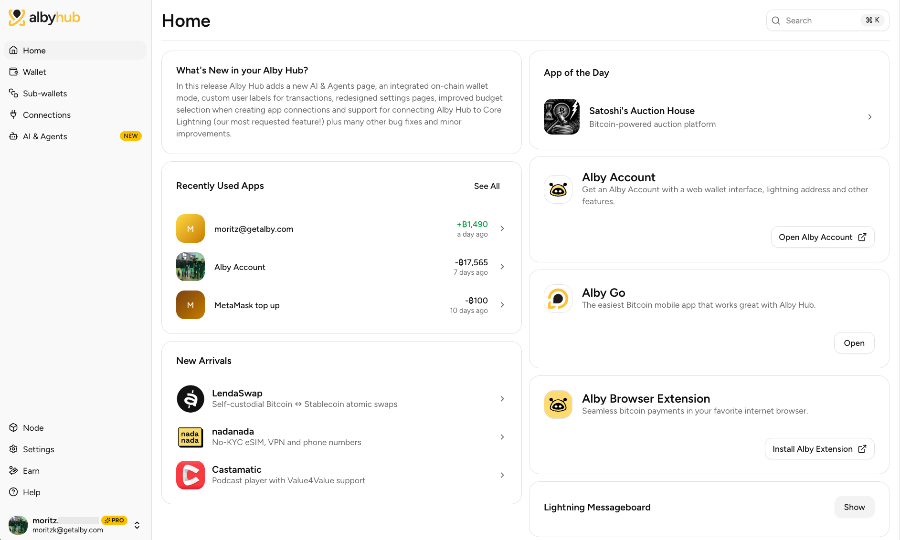

# Bonus guide: Alby Hub, a self-custodial Lightning node manager

{: .no_toc }

---

[Alby Hub](https://getalby.com/alby-hub){:target="_blank"} is a self-custodial wallet with the easiest to use lightning node, accessible from anywhere to integrate with dozens of apps such as the [Alby Browser Extension](https://getalby.com/alby-extension){:target="_blank"}, [Alby Go](https://getalby.com/alby-go){:target="_blank"} mobile app or AI agents. Run Alby Hub with the embedded - very resource efficient - lightning node or connect it to an existing LND node.

Difficulty: Easy
{: .label .label-green }

Status: Untested
{: .label .label-yellow }



---

Table of contents
{: .text-delta }

1. TOC
{:toc}

---

## Preparations

### Firewall & reverse proxy

* Configure the firewall to allow incoming HTTPS requests.

  ```sh
  $ sudo ufw allow 4004/tcp comment 'allow Alby Hub SSL'
  $ sudo ufw status
  ```

* Enable NGINX reverse proxy to route external encrypted HTTPS traffic internally to Alby Hub.

  ```sh
  $ sudo nano /etc/nginx/streams-enabled/albyhub-reverse-proxy.conf
  ```

  ```nginx
  upstream albyhub {
    server 127.0.0.1:8080;
  }
  server {
    listen 4004 ssl;
    proxy_pass albyhub;
  }
  ```

* Test and reload NGINX configuration.

  ```sh
  $ sudo nginx -t
  $ sudo systemctl reload nginx
  ```

---

## Alby Hub

### Installation

* Create a new `albyhub` user and add it to the `lnd` group so it can read the LND certificate and macaroon.

  ```sh
  $ sudo adduser --disabled-password --gecos "" albyhub
  $ sudo adduser albyhub lnd
  ```

* Create a data directory and transfer ownership to the new user.

  ```sh
  $ sudo mkdir /data/albyhub
  $ sudo chown -R albyhub:albyhub /data/albyhub
  ```

* Open a new `albyhub` user session.

  ```sh
  $ sudo su - albyhub
  ```

* Download the latest Alby Hub release binary. Choose the correct archive for your hardware.

  For **Raspberry Pi 4 / 5** (aarch64):

  ```sh
  $ wget https://github.com/getAlby/hub/releases/download/v1.22.2/server-linux-aarch64.tar.bz2
  $ tar -xvjf server-linux-aarch64.tar.bz2 --strip-components=0 -C /data/albyhub
  $ rm server-linux-aarch64.tar.bz2
  ```

  For **x86\_64** systems:

  ```sh
  $ wget https://github.com/getAlby/hub/releases/download/v1.22.2/server-linux-x86_64.tar.bz2
  $ tar -xvjf server-linux-x86_64.tar.bz2 --strip-components=0 -C /data/albyhub
  $ rm server-linux-x86_64.tar.bz2
  ```

* Verify the binary is present.

  ```sh
  $ ls /data/albyhub/bin/albyhub
  > /data/albyhub/bin/albyhub
  ```

### Configuration

* Still as user `albyhub`, create the environment configuration file.

  ```sh
  $ nano /data/albyhub/.env
  ```

* Paste the following configuration. This connects Alby Hub to your existing LND node.

  ```ini
  PORT=8080
  WORK_DIR=/data/albyhub

  # Connect to existing LND node
  LN_BACKEND_TYPE=LND
  LND_ADDRESS=localhost:10009
  LND_CERT_FILE=/data/lnd/tls.cert
  LND_MACAROON_FILE=/data/lnd/data/chain/bitcoin/mainnet/admin.macaroon
  ```

* Save (Ctrl+o) and close (Ctrl+x). Restrict read/write permissions to the `albyhub` user only.

  ```sh
  $ chmod 600 /data/albyhub/.env
  ```

### First start

* Start Alby Hub manually to verify it works.

  ```sh
  $ /data/albyhub/bin/albyhub
  ```

* Open your browser and navigate to <https://raspibolt.local:4004> (or your node's IP address, e.g. <https://192.168.0.20:4004>).

  Your browser will display a warning because of the self-signed SSL certificate. Click "Advanced" and proceed to the Alby Hub web interface. You will be guided through the initial setup to create an unlock password and connect your node.

* Stop Alby Hub in the terminal with `Ctrl`-`C` and exit the `albyhub` user session.

  ```sh
  $ exit
  ```

### Autostart on boot

* As user "admin", create the systemd service file.

  ```sh
  $ sudo nano /etc/systemd/system/albyhub.service
  ```

* Paste the following configuration. Save (Ctrl+o) and close (Ctrl+x).

  ```ini
  # RaspiBolt: systemd unit for Alby Hub
  # /etc/systemd/system/albyhub.service

  [Unit]
  Description=Alby Hub
  After=lnd.service
  PartOf=lnd.service

  [Service]
  WorkingDirectory=/data/albyhub
  ExecStart=/data/albyhub/bin/albyhub
  EnvironmentFile=/data/albyhub/.env
  User=albyhub
  Restart=always
  TimeoutSec=120
  RestartSec=30
  StandardOutput=journal
  StandardError=journal

  # Hardening measures
  PrivateTmp=true
  ProtectSystem=full
  NoNewPrivileges=true
  PrivateDevices=true

  [Install]
  WantedBy=multi-user.target
  ```

* Enable the service, start it, and check the log output.

  ```sh
  $ sudo systemctl enable albyhub.service
  $ sudo systemctl start albyhub.service
  $ sudo systemctl status albyhub.service
  $ sudo journalctl -f -u albyhub
  ```

* You can now access Alby Hub from within your local network by browsing to <https://raspibolt.local:4004>{:target="_blank"} (or your equivalent IP address).

---

## Remote access over Tor (optional)

* Add the following three lines in the "location-hidden services" section of the `torrc` file. Save and exit.

  ```sh
  $ sudo nano /etc/tor/torrc
  ```

  ```ini
  ############### This section is just for location-hidden services ###
  # Hidden Service Alby Hub
  HiddenServiceDir /var/lib/tor/hidden_service_albyhub/
  HiddenServiceVersion 3
  HiddenServicePort 80 127.0.0.1:8080
  ```

* Reload Tor configuration and get your connection address.

  ```sh
  $ sudo systemctl reload tor
  $ sudo cat /var/lib/tor/hidden_service_albyhub/hostname
  > abcdefg..............xyz.onion
  ```

* With the [Tor browser](https://www.torproject.org){:target="_blank"}, you can access this onion address from any device.

---

## For the future: Alby Hub update

Updating to a [new release](https://github.com/getAlby/hub/releases){:target="_blank"} is straightforward using the included update script.

* Stop the service and open an `albyhub` user session.

  ```sh
  $ sudo systemctl stop albyhub
  $ sudo su - albyhub
  ```

* Run the update script. It backs up the current installation, downloads the latest release, verifies the signature, and replaces the binaries.

  ```sh
  $ cd /data/albyhub && ./update.sh
  $ exit
  ```

* Start the service again.

  ```sh
  $ sudo systemctl start albyhub
  ```

---

## Uninstall

* Stop and disable the systemd service, then delete the service file.

  ```sh
  $ sudo systemctl stop albyhub.service
  $ sudo systemctl disable albyhub.service
  $ sudo rm /etc/systemd/system/albyhub.service
  ```

* Display the UFW firewall rules and note the numbers of the rules for Alby Hub (e.g., X and Y below).

  ```sh
  $ sudo ufw status numbered
  > [...]
  > [X] 4004                   ALLOW IN    Anywhere                   # allow Alby Hub SSL
  > [...]
  > [Y] 4004 (v6)              ALLOW IN    Anywhere (v6)              # allow Alby Hub SSL
  ```

* Delete the two Alby Hub firewall rules (type "y" and "Enter" when prompted).

  ```sh
  $ sudo ufw delete Y
  $ sudo ufw delete X
  ```

* Delete the NGINX reverse proxy configuration.

  ```sh
  $ sudo rm /etc/nginx/streams-enabled/albyhub-reverse-proxy.conf
  $ sudo nginx -t
  $ sudo systemctl reload nginx
  ```

* Delete the data directory and the `albyhub` user.

  ```sh
  $ sudo rm -r /data/albyhub
  $ sudo userdel -r albyhub
  ```

<br /><br />

---

<< Back: [+ Lightning](index.md)
